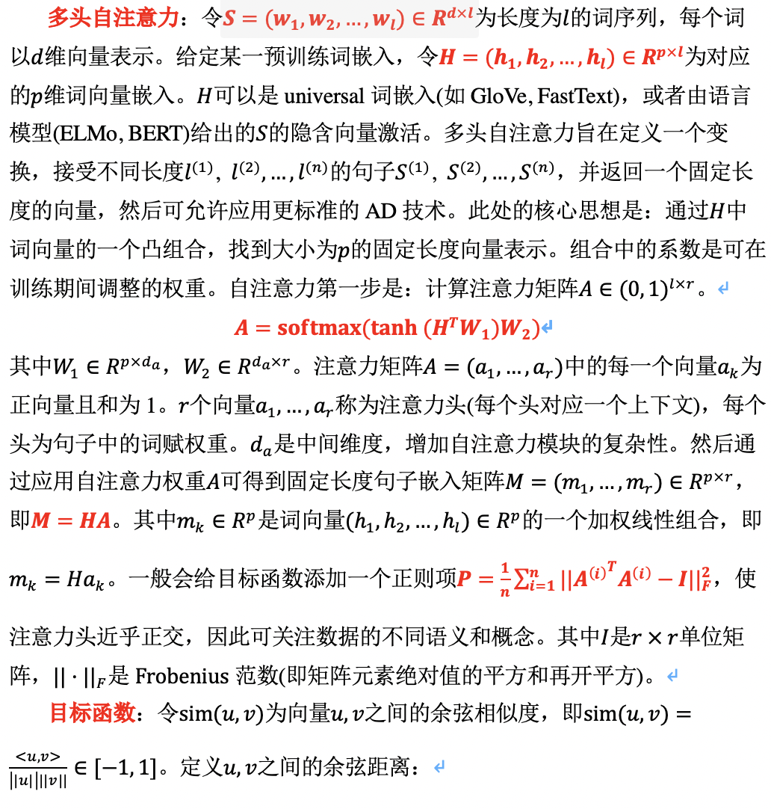
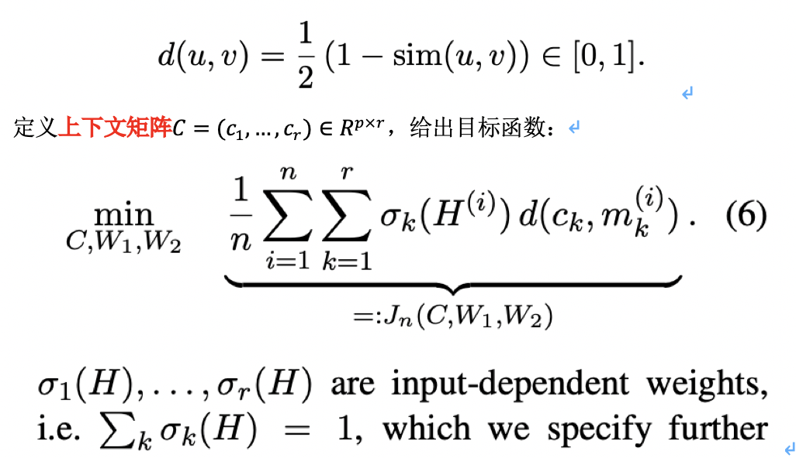
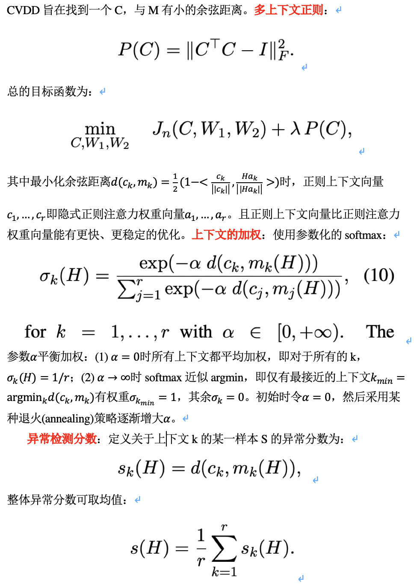

## 核心思想
### 文本异常检测任务
- CVDD(Context Vector Data Description)
	- (多头)自注意力, 多上下文(正则), one-class分类方法
	- 无监督文本AD
	- 实验:
		- 优化: SGD/Adam
		- 数据集: Reuters-21578, 20 Newsgroups, IMDB Movie Reviews; 前两个定量分析，后一个定性分析
		- 数据预处理: 小写; 去除标点, 数字以及空白; 移除停用词(nltk); 仅考虑长度>=3的词 
		- 固定长度句子表示基线: 均值, tfidf加权均值, max-pooling
		- 预训练模型: GloVe(6B/300), fast-Text(300), BERT(没有提升/增加计算成本)
		- 以k-means++初始化上下文向量(平均词嵌入); 提高优化速度和性能
		- CVDD的配置: d_a=150; batch_size=64; 学习率前40epoch为0.01, 后60epoch为0.001; 加权上下文使用对数退火策略, 每20epoch更新一次

## 参考文献
- Self-Attentive, Multi-Context One-Class Classification for Unsupervised Anomaly Detection on Text
- DATE: Detecting Anomalies in Text via Self-Supervision of Transformers