## 核心思想
### 图像分类任务
- 不平衡(imbalanced)学习和标签的价值(value)
	- 标签监督(supervision)比无监督的效果要好
	- 极度(heavily)不平衡数据会引发分类器的**标签偏差(bias)**, 即决策边界会被多数(majority)类改变
	- 类不平衡(class-imbalanced)学习可受益于半监督学习和自监督方式
	- 专门技术: 数据重采样(re-sampling)方法和类平衡(class-balanced)损失, 在极度(extreme)类不平衡情况下性能仍会下降
- 半监督学习: 利用更多的未标记(unlabeled)数据(额外数据)
	- 利用伪标签(pseudo-labeling)策略
	- 理论证明中的最优贝叶斯分类器推导存疑
	- 从定理中可看出: 
		- 训练数据不平衡影响估计的精度: 越不平衡, p-q越大, 影响估计和要学习值之间的closeness
		- 未标记数据不平衡影响获得好估计的概率: 对于好的基分类器, 可大致将未标记数据集中估计的正负样本数看作是实际的正负样本数; 对于概率的第二项, 当且仅当正负样本数相等时(数据集平衡)取最大值; 对于第3,4项, 少数类对应的项会占统治地位; 当数据集平衡, 概率会更高, 但任何情况下, 更多未标记数据总是有用的
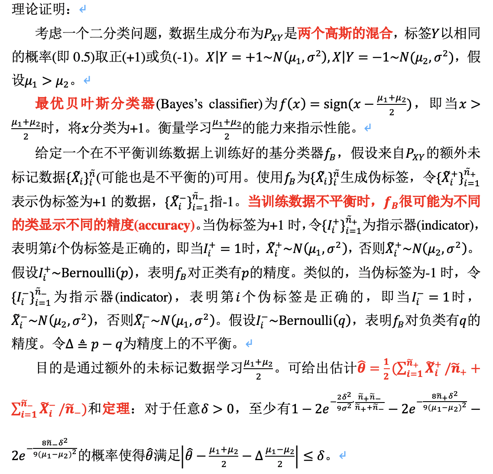
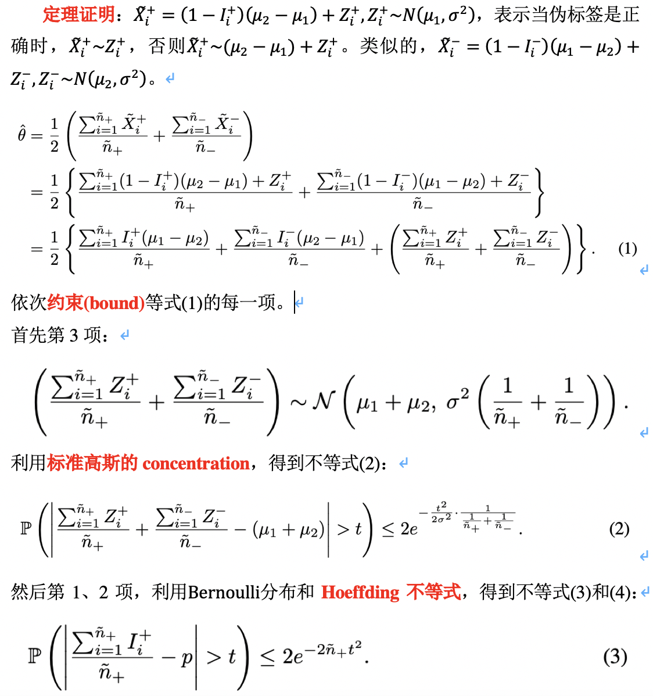
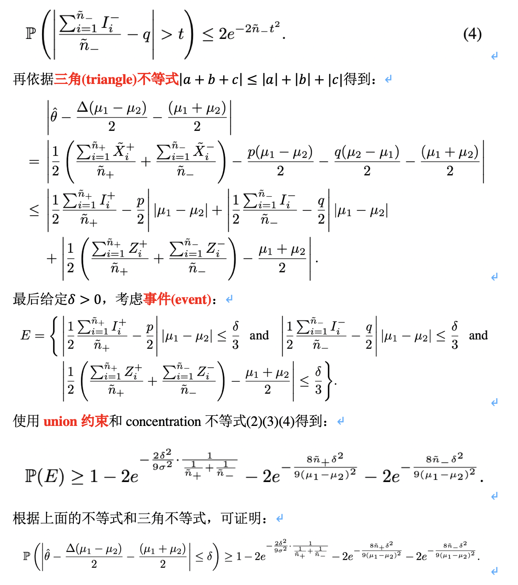
- 自监督学习: 预训练分类器
	- 在最初的时候抛弃标签
	- 定理一的证明中误差概率对应的事件是小于0(存疑), 以及推导公式第3-4行的变换(存疑)
	- 自监督给出的更好的分类器的函数形式(存疑)
	- sub-exponential随机变量(存疑)
	- 定理二的证明中推导公式第3-4行的变换(存疑)
	- 各种形式的concentration不等式(存疑)
	- 从理论证明中可以看出:
		- 自监督学习可以较高的概率获得令人满意的分类器, 其误差概率在维度d上呈指数下降; 获得这样的分类器的概率也指数依赖于d和数据量
		- 训练数据不平衡会影响获得这样分类器的概率; 若正样本数特别小, 则概率中对应的项占据统治地位; 但由于依赖是指数的, 尽管训练数据不平衡, 自监督学习还是有助于获得令人满意的分类器
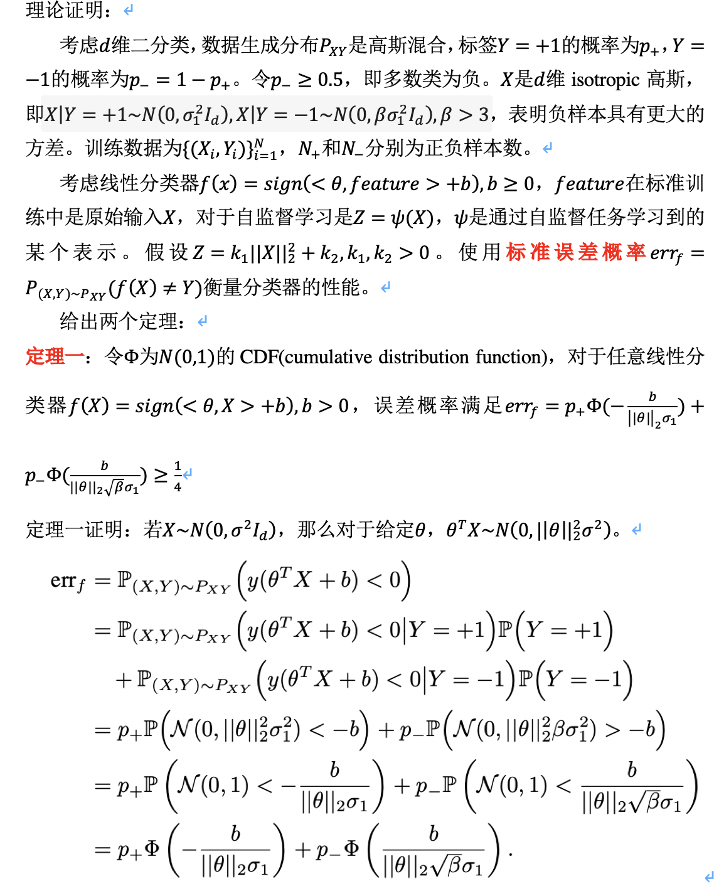
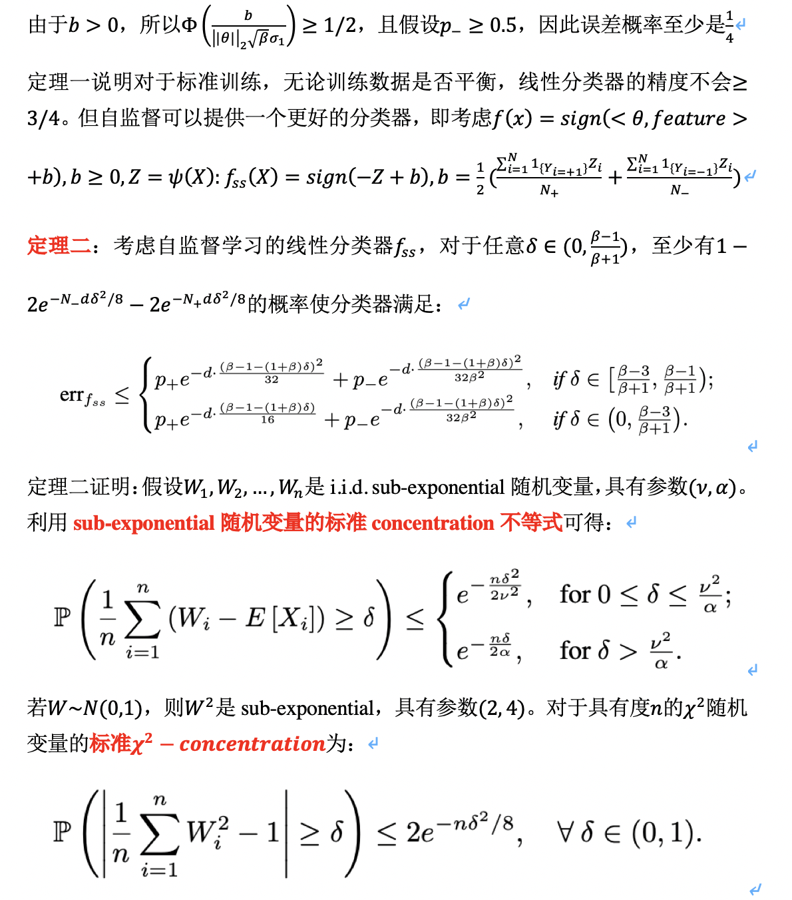
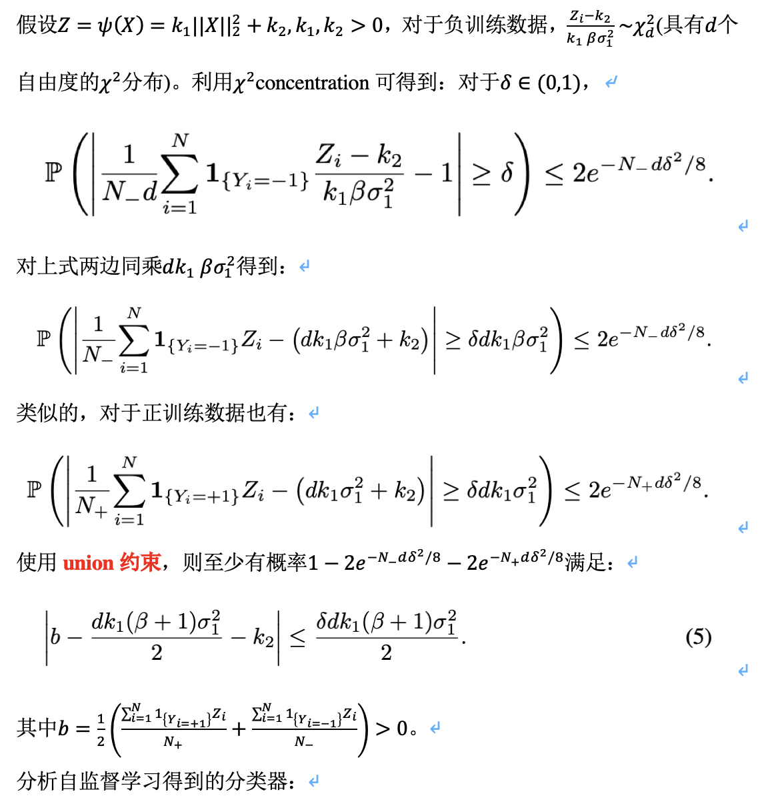
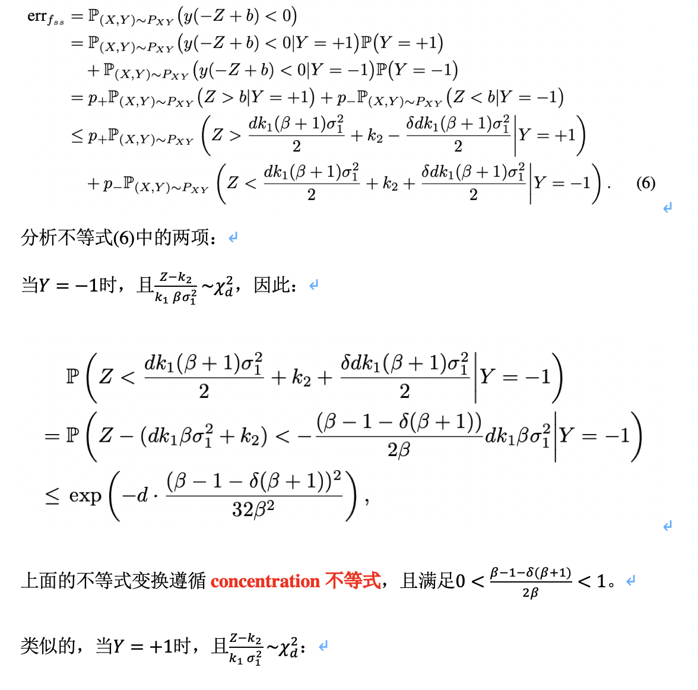
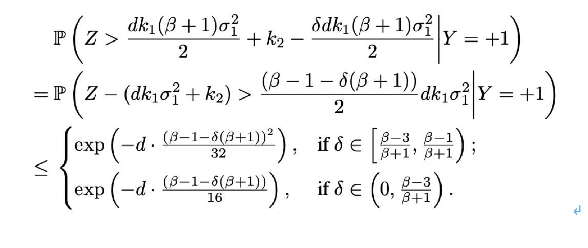
- 不平衡学习框架
	- 半监督: 伪标签和训练数据中的标签信息有助于不平衡学习; 有用性受数据(未标记数据)的不平衡性影响
		- self-training框架: 执行半监督学习(SSL)为未标记数据生成伪标签
		- 除了self-training, 还可以采用更先进的SSL技术(只需要修改损失函数)
		- 兼容现有的类不平衡学习方法
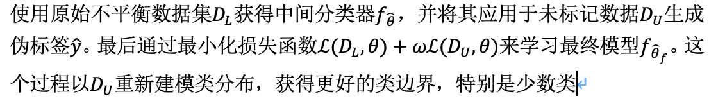
		- 实验:
			- 数据集: 人为创建长尾版本的CIFAR-10和SVHN, 它们对应的未标记数据集分别是80 Million Tiny Images和SVHN自己额外的数据集
			- 类不平衡率定义为最多数类的样本大小除以最少数类; 对于未标记数据集, 也定义未标记不平衡率
			- 未标记数据量是原始数据量的5倍多
			- 采用标准交叉熵(CE)训练
			- 在对应平衡的测试集上评估模型
			- 基线模型是不平衡学习方法LDAM-DRW
				- 交叉熵损失的形式(存疑)
				- 提出deferred re-balancing(DRW)训练过程
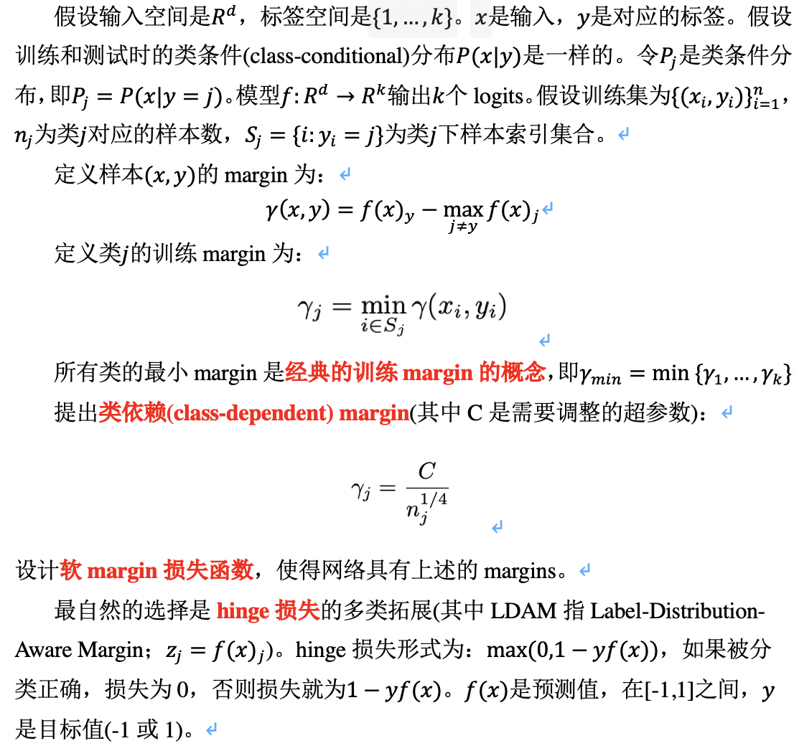
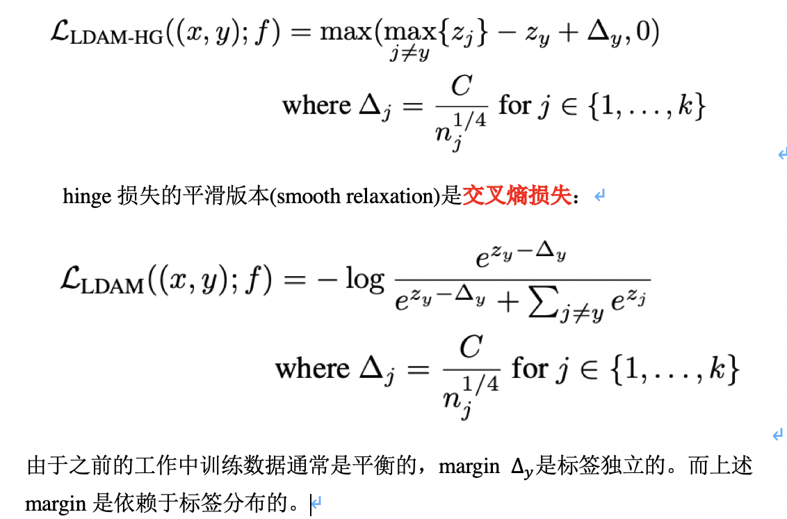
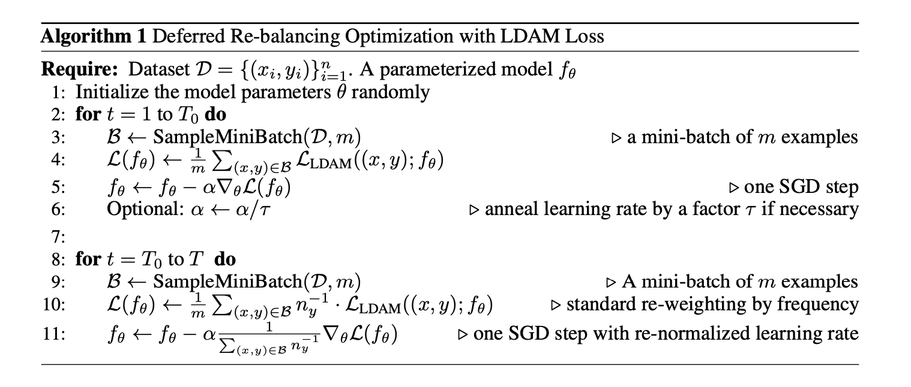
	- 自监督: 在学习的第一阶段, 抛弃标签信息并执行自监督预训练(SSP); 该过程旨在学习更好的初始化, 是标签无关的(label-agnostic); 之后执行任意标准训练方法学习由预训练网络初始化的最终模型; 由于预训练独立于学习方法, 该策略兼容任何现有的不平衡学习技术
		- 一旦自监督产生好的初始化, 网络会受益于预习训练任务, 最终学习到更一般化的表示
		- 实验: 
			- 数据集: CIFAR-10-LT和CIFAR-100-LT, 以及大规模长尾数据集, 包括ImageNet-LT和真实世界数据集iNaturalist 2018 
			- 在对应平衡的测试集上评估模型
			- CIFAR-LT使用Rotation作为SSP, ImageNet-LT和iNaturalist使用MoCo
- Resnet: 添加shortcut connections(element-wise加法)
	- 每隔几层(一般2-3层)应用residual学习, 若只有1层, 则没有优势
	- 若输入输出维度相同, 可直接使用identity shortcuts; 若维度增加, 可有两个选择: (1)仍使用identity shortcuts, 增加的维度用0补齐, 这样不增加额外参数; (2)对输入进行线性映射(以1x1卷积实现)以对齐维度
	- 当特征地图的尺寸发生变化, 需要令stride=2(存疑)
	- 实验:
		- 在卷积后激活函数前应用批归一化(BN)
		- 没有使用dropout
		- SGD+mini-batch-size/256+initial LR/0.1/10
		- 迭代至多60x10^4
		- weight decay/0.0001+momentum/0.9
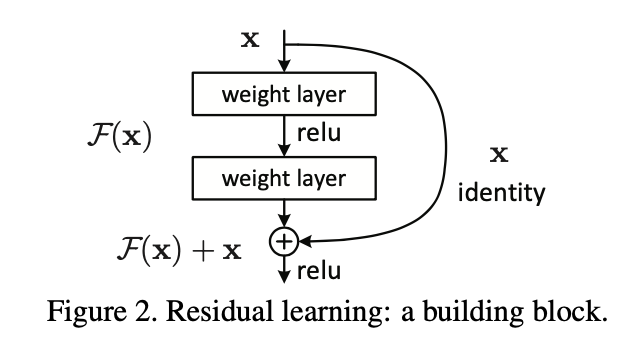
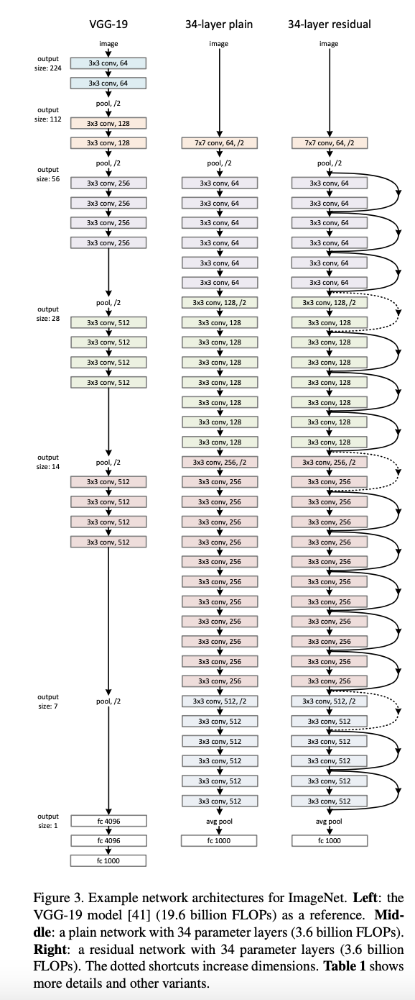

## 参考文献
- Rethinking the Value of Labels for Improving Class-Imbalanced Learning
- [concentration inequality](https://www.stat.berkeley.edu/~mjwain/stat210b/Chap2_TailBounds_Jan22_2015.pdf)
- Learning Imbalanced Datasets with Label-distribution-aware Margin Loss
- Momentum Contrast for Unsupervised Visual Representation Learning
- Deep Residual Learning for Image Recognition