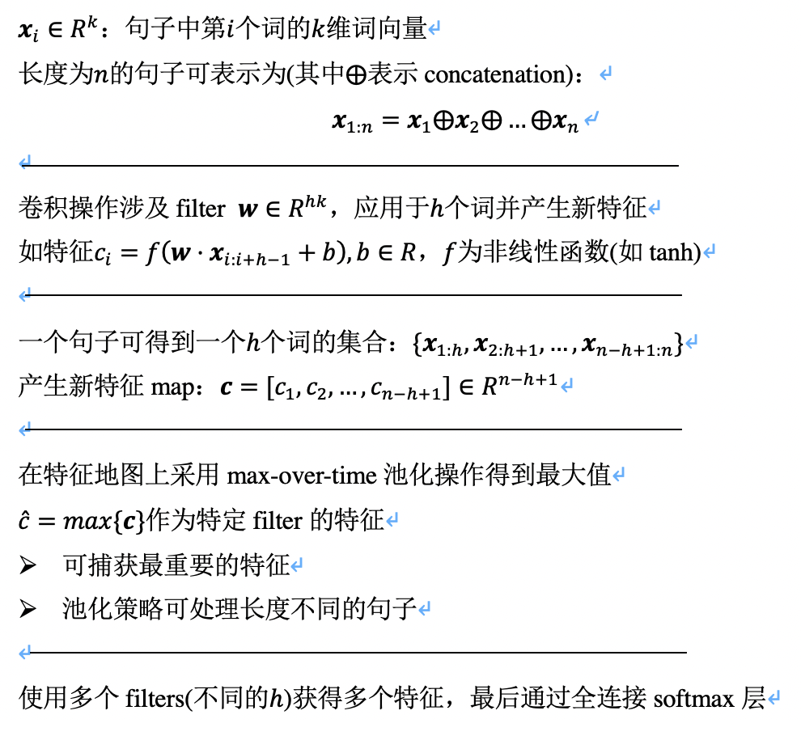
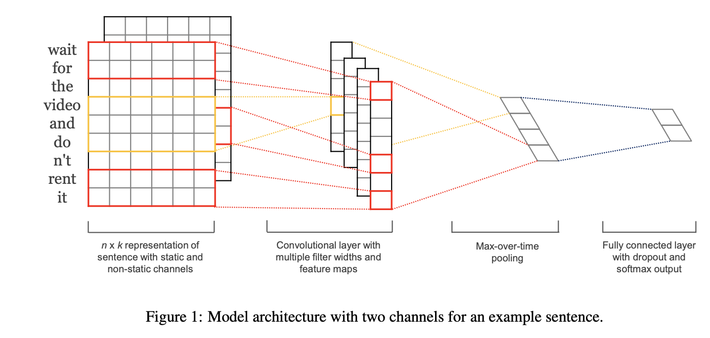
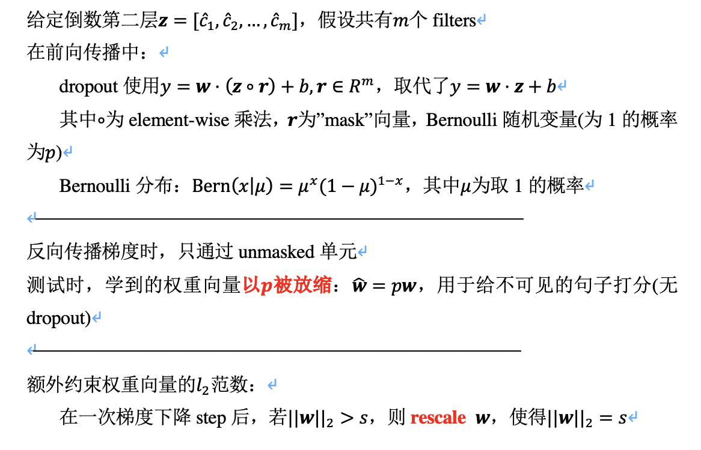
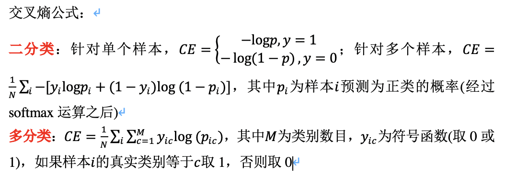

## 核心思想
### 文本分类任务
- TextCNN
	- 模型整体思想

	- 双通道: 一个在训练过程中保持静止, 另一个通过反向传播微调
		- 使用双通道时, 每个filter都应用于多个通道, 并将得到的结果相加(存疑)

	- 正则化: 倒数第二层应用dropout(约束权重向量的L2范数)
		- dropout防止隐含单元的co-adaptation(在前向-反向传播中随机将隐含单元的部分设置为0)
		- 存疑: 测试时的相关操作, 包括放缩等

	- 实现时采用交叉熵损失函数

## 参考文献
- Convolutional Neural Networks for Sentence Classification
- Towards Unsupervised Text Classification Leveraging Experts and Word Embeddings
- Graph Convolutional Networks for Text Classification
- Metric Learning for Dynamic Text Classification