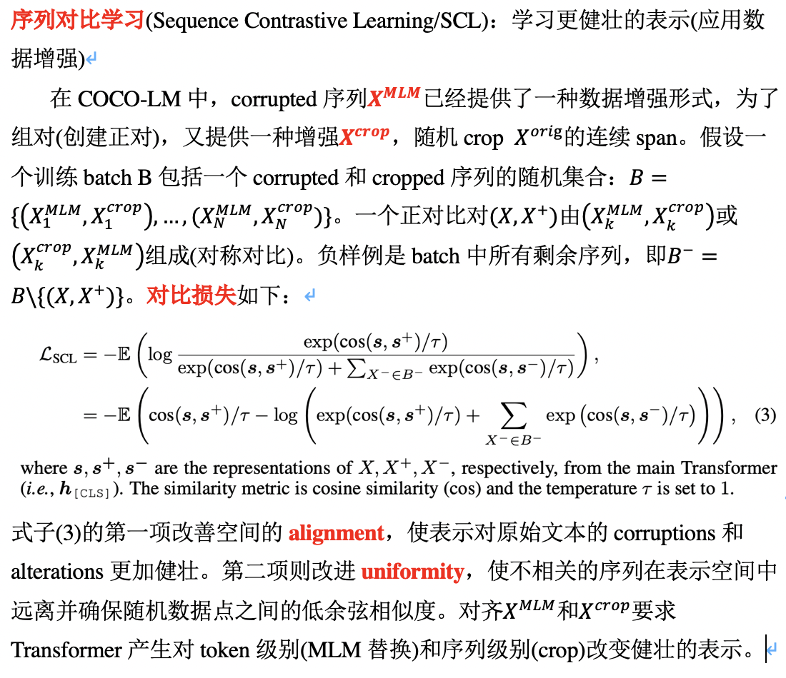
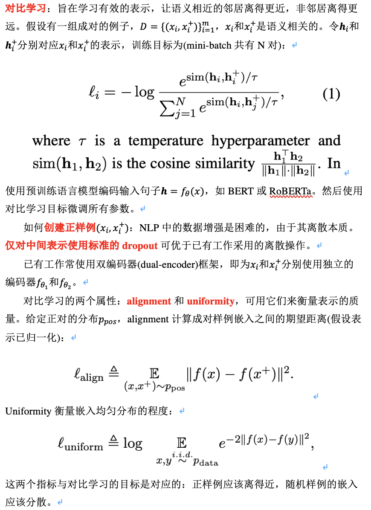
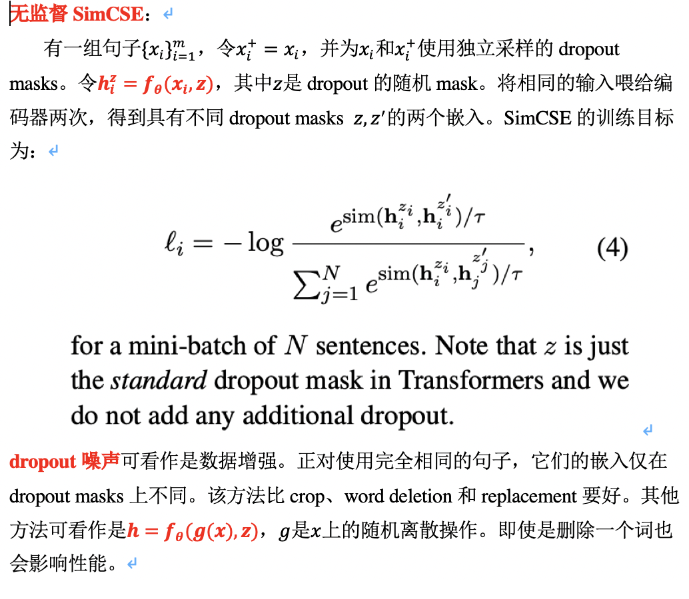
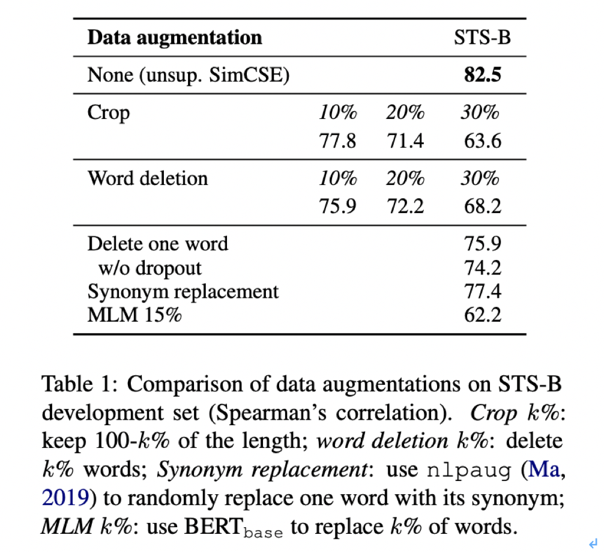

## 核心思想
### 句子表示
- CLEAR

- COCO-LM

- SimCSE

## 参考文献
- COCO-LM: Correcting and Contrasting Text Sequences for Language Model Pretraining
- CLEAR: Contrastive Learning for Sentence Representation
- SimCSE: Simple Contrastive Learning of Sentence Embeddings