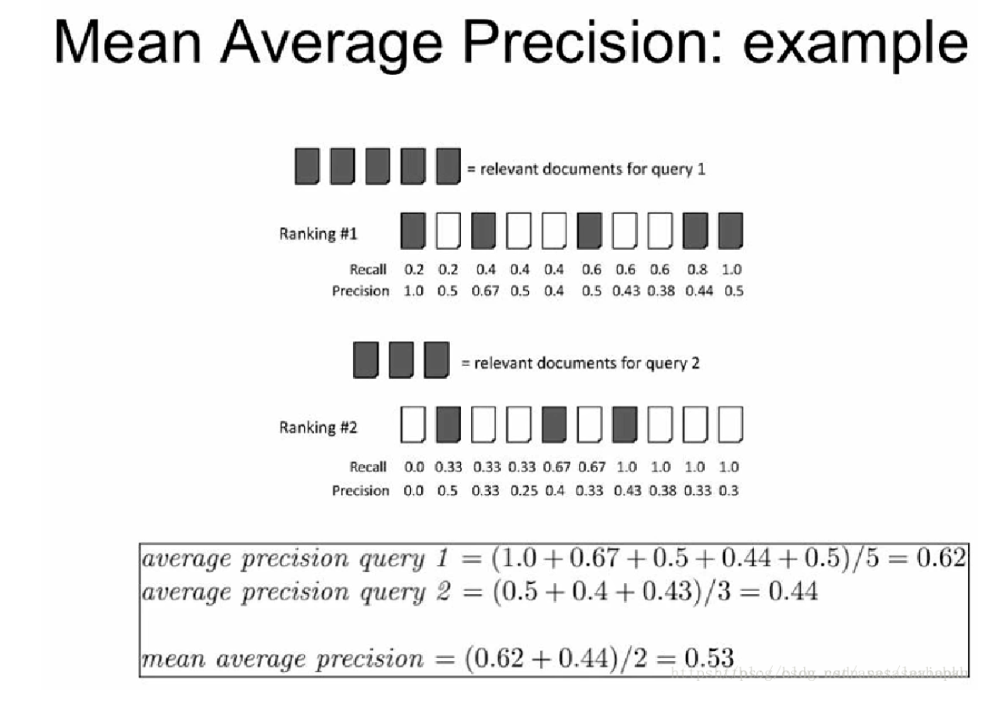

## 核心思想
### 文本去重任务
- Near-duplicate Detection / Similarity Search
- 主要的文本去重方法有两种:
    - 基于相似性的方法: 内容或结构相似性, 内容包括字符串匹配(Shingling)和语义向量计算(TF/TFIDF)
    - 基于摘要技术的方法: 文本特征提取+摘要计算(哈希)
        - 局部敏感哈希(Locality Sensitive Hashing)
        - 哈希学习(Learning to Hash)
        - 区别在于是否根据数据分布学习哈希函数
- LSH: 基于一组哈希函数的定义, 这些函数能以更高的概率将相似的输入项映射成相同的哈希码(比起不相似的输入项)
    - 这样的一组哈希函数一般针对不同的距离或相似性定义, 例如针对基于角度(angle-based)的距离定义的sign-random-projection(or simhash)
- simhash: 基于随机映射和向量之间的角度
    - 特征映射: 适用于大规模数据, 能快速判重

- 实验指标
    - mean average precision(MAP): mean是针对所有query而言的, 需要对每个query计算average precision, 即针对每个query得到的排序列表，统计所有相关item的precision的均值; 每个相关item的precision计算需要对所有相关item从左到右从1-len(items)打分，并除以item对应的索引位置(需要+1)
    - P_R曲线: P和R都是长度为code_length的列表, 先依次遍历每个query计算一个PR列表，然后求均值; 每个PR列表是通过以每个code位置为阈值对照求得的海明距离计算来的

## 参考文献
- Hashing for Similarity Search: A Survey
- Detecting Near-Duplicates for Web Crawling